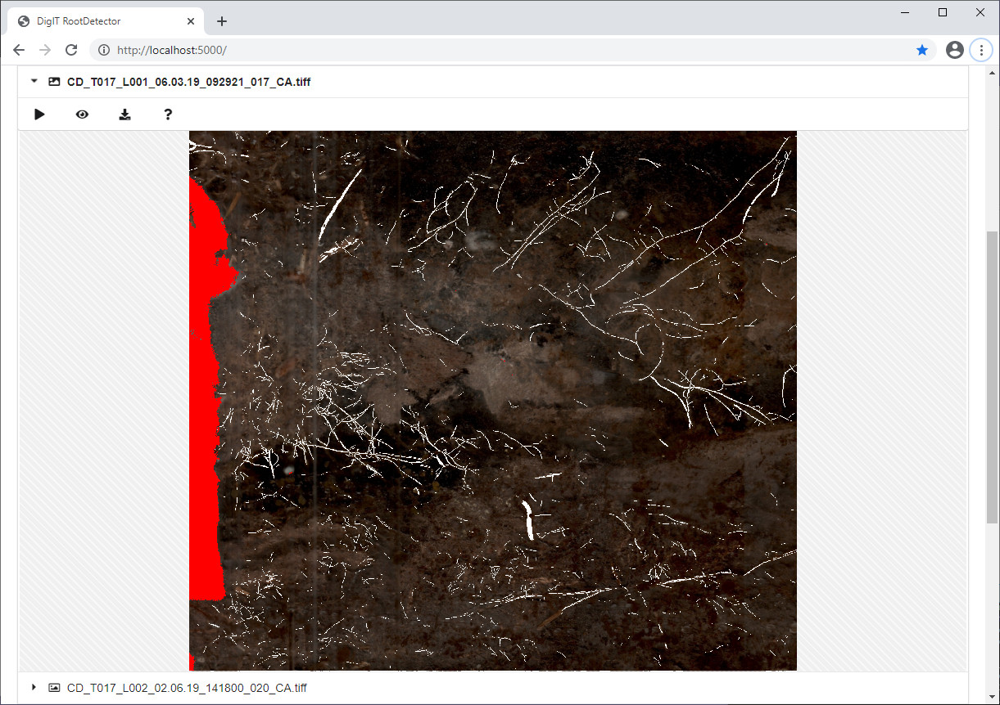

# Root-Detector
Analysis tool for minirhizotron images

Windows binaries: [Download](https://github.com/alexander-g/Root-Detector/releases/download/v2023-02-03/2023-02-03_16h32m11s_DigIT_RootDetector.zip)

User Guide v.1 07-03-25: [Download](https://github.com/ExPlEcoGreifswald/RootDetector/edit/main/AI%20Analysis%20of%20Minirhizotron%20Imagery%20Using%20RootDetector.pdf)

Screenshot:




***

### Running from source

Tested with Python 3.7

```bash
#clone the repository including submodules
git clone --recursive https://github.com/alexander-g/Root-Detector.git
cd Root-Detector

#create new virtual environment and install requirements
python -m venv venv
source venv/bin/activate              #linux
#venv/Scripts/activate.bat                #windows
pip install -r requirements.txt

#download pretrained models
python fetch_pretrained_models.py

#run
python main.py

#in a browser, navigate to http://localhost:5000
#drag+drop images from images/sample_data and process
```

***

### Citation
Source code for publication:
```
Peters, B. et al. "As good as but much more efficient and reproducible 
than human experts in detecting plant roots in minirhizotron images: 
The Convolutional Neural Network RootDetector" (2023)
http://doi.org/10.1038/s41598-023-28400-x
```


Root tracking:
```
Alexander Gillert, Bo Peters, Uwe Freiherr von Lukas, Jürgen Kreyling and Gesche Blume-Werry. 
"Tracking Growth and Decay of Plant Roots in Minirhizotron Images." 
Proceedings of the IEEE/CVF Winter Conference on Applications of Computer Vision (WACV), 2023
https://doi.org/10.1109/WACV56688.2023.00369
```
