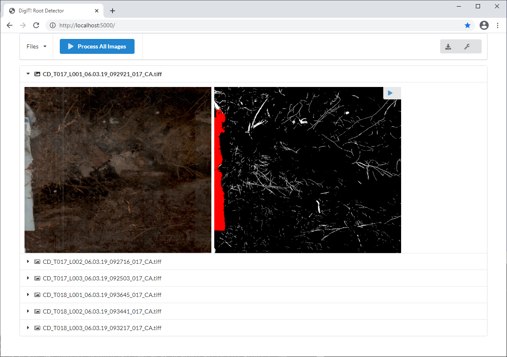

# Root-Detector
Analysis tool for minirhizotron images

Windows binaries: [Download](https://github.com/alexander-g/Root-Detector/releases/download/2022-01-14/20220114_15h22m18s_DigIT_RootDetector.zip)
***


Source code for publication (in review):

```Peters, B. et al. "As good as but much more efficient and reproducible than human experts in detecting plant roots in minirhizotron images: The Convolutional Neural Network RootDetector" (2022)```

***

Screenshot:



