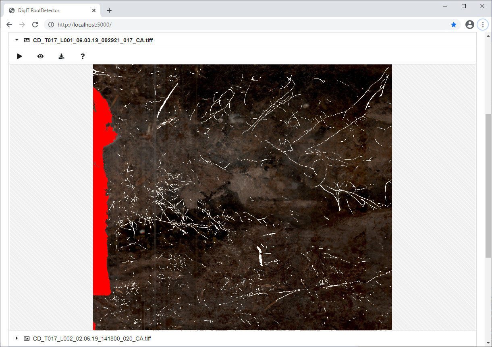

# RootDetector

RootDetector helps researchers and students analyze minirhizotron root images. It can identify roots, calculate root and skeleton measurements, and compare images from different dates to visualize root growth and decay.



## What You Can Do

- Detect roots in PNG, JPEG, TIFF, and TIF images.
- Create segmentation and skeleton images automatically.
- Compare consecutive observations of the same sample.
- Visualize unchanged roots, new growth, and decay.
- Review tracking results and make manual corrections when necessary.
- Export images, statistics, and tracking metadata as ZIP and CSV files.

## Install and Start on Windows

RootDetector is distributed to ordinary users as a **Windows-binaries ZIP**. Download the full ZIP from the project's Releases page; do not choose GitHub's automatically generated “Source code” archives.

1. Extract the entire ZIP to a writable folder such as `Documents\RootDetector`.
2. Open the extracted folder and double-click **`StartRootDetector.bat`**.
3. Keep the console window open. RootDetector starts its local service and opens the interface in your default browser.
4. On the first start, allow time for required model and PyTorch files to download. Internet access to `download.pytorch.org`, `github.com`, and the configured model hosts is required. If a proxy or firewall blocks a download, correct the connection and run the launcher again.

New full Windows packages contain **only `StartRootDetector.bat`** as the launcher. Older 2023 downloads used `main.bat`; those existing downloads are unchanged. GitHub's “Source code” ZIP is not a ready-to-run Windows package.

The Windows package is currently unsigned, so Windows may show a security warning. Only run an archive obtained from a release you trust. Developers who want to run or modify the source should use the [Technical Guide](TECHNICAL-GUIDE.md).

## Prepare Your Images

Tracking depends on filenames that identify both the sample and observation date. Keep the sample portion identical and include a supported date separated by underscores:

```text
Sample_A_17.10.18_image.tiff
Sample_A_13.11.18_image.tiff
```

Supported date forms include `DD.MM.YY`, `DD.MM.YYYY`, and `YYYY.MM.DD`. RootDetector groups matching samples, sorts them by date, and proposes consecutive tracking pairs.

## Run an Analysis

1. Select **Files → Load Input Images** or **Load Input Folder**.
2. Confirm that all images appear in the Detection tab.
3. Open the Tracking tab and check the proposed image pairs.
4. Open **Settings** if you need to choose the WM or beech model, enable an exclusion-mask model, or change the root threshold.
5. Select **Run Analysis** once.
6. Wait for the progress window to reach 100%. Detection runs for every image, followed by tracking for every valid pair.

One failed image no longer stops unrelated images. The summary identifies completed, failed, skipped, or review-required items. Use **Retry failed** after correcting a recoverable problem.

Input preparation is resumable while the application remains open. If a local upload is interrupted, RootDetector retries it up to two times and keeps already accepted files ready for the next **Run Analysis** attempt. The progress window labels upload separately from detection and tracking.

## Review and Export Results

The Detection tab provides root segmentation and skeleton overlays. The Tracking tab shows turnover results:

- White: root present at both dates.
- Green: new root growth.
- Pink/red: root decay.
- Red mask: excluded material such as tape.

Use **Download All** in the relevant tab to save results before closing the application. The working cache and run history are temporary and are cleared when a new image set is loaded or the application restarts.

Tracking uses the released point-sampling behavior, so repeating the same pair can produce different turnover counts. Review tracking overlays before scientific interpretation, and retain the source images, selected models, settings, and exported results for each run.

## Train a Model (Optional)

Training is separate from ordinary analysis. You do not need to review or label every image you analyze. For training, prepare a smaller, representative set of original images with matching masks that a person has independently checked and corrected where needed. Load the originals, then choose **Files → Load Annotations** for those masks. The Training tab asks you to confirm their review before **Start Training** becomes available. Automatically produced detection masks—including masks in a results ZIP—are predictions, not verified training labels. Keep different tubes/sites and dates out of the evaluation set so you can test the new model on genuinely unseen images.

## Common Problems

- **The first start appears slow:** model and PyTorch downloads can be large. Keep the console open and check the internet connection.
- **The first start stops with a download error:** allow access to the required hosts, verify free disk space, and run **StartRootDetector.bat** again. Existing verified downloads are reused.
- **An image is rejected:** use PNG, JPEG, TIFF, or TIF and ensure the file is not damaged.
- **An image exceeds the upload limit:** the default is 256 MiB per file. Ask a maintainer to adjust the local limit after checking available memory and the image's dimensions; the [Technical Guide](TECHNICAL-GUIDE.md) explains how.
- **No tracking pair appears:** verify that at least two filenames share the same sample name and contain supported dates.
- **Tracking says “too many roots”:** this safety limit prevents excessive memory use. Use a suitable lower-root pair for tracking; raise the threshold only for a deliberate expert run on adequately resourced hardware.
- **Tracking requires review:** too few reliable automatic matches were found. Inspect or correct the pair manually.
- **An error needs technical help:** choose **Download diagnostics** in the analysis window. The ZIP excludes input images, results, and environment variables. Its logs can contain research filenames and technical paths, so review it before sharing.

## Data and Privacy

Image processing happens on the local computer. RootDetector does not upload research images to a cloud service. The application accesses the internet on first launch to obtain runtime and model files.

## Further Documentation

- [Technical Guide](TECHNICAL-GUIDE.md) — architecture, development, testing, API, and Windows release process.
- [Scientific and user guide](AI%20Analysis%20of%20Minirhizotron%20Imagery%20Using%20RootDetector.pdf).

## License and Citation

RootDetector is distributed under the [MIT License](LICENSE).

For root detection, cite Peters, B. et al., “As good as but much more efficient and reproducible than human experts in detecting plant roots in minirhizotron images: The Convolutional Neural Network RootDetector,” *Scientific Reports* (2023), [doi:10.1038/s41598-023-28400-x](https://doi.org/10.1038/s41598-023-28400-x).

For root tracking, cite Gillert, A. et al., “Tracking Growth and Decay of Plant Roots in Minirhizotron Images,” *WACV* (2023), [doi:10.1109/WACV56688.2023.00369](https://doi.org/10.1109/WACV56688.2023.00369).
